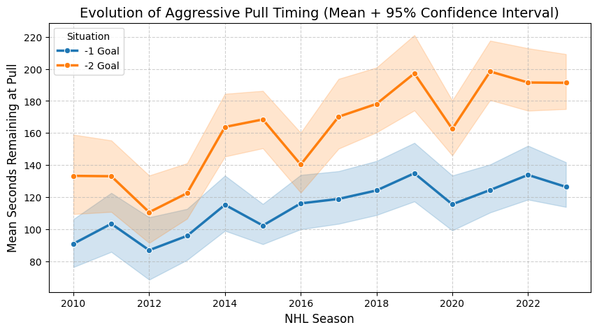
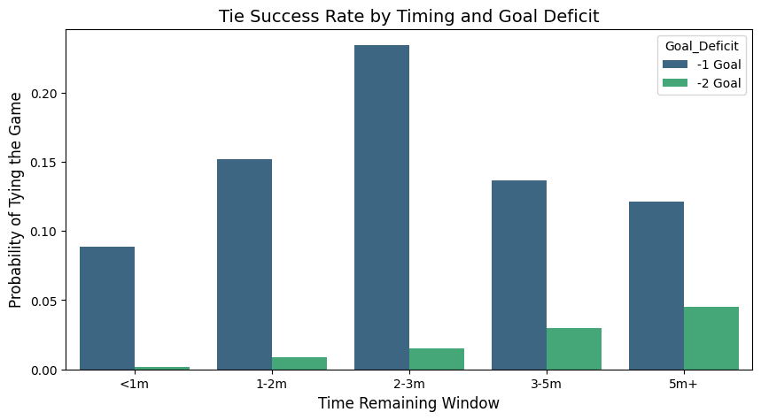
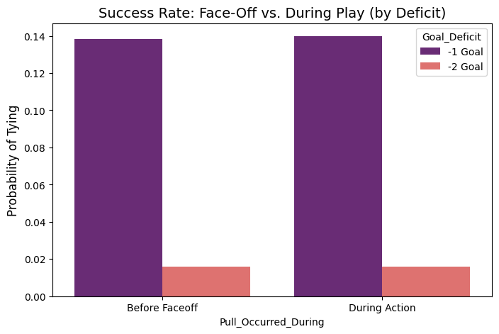
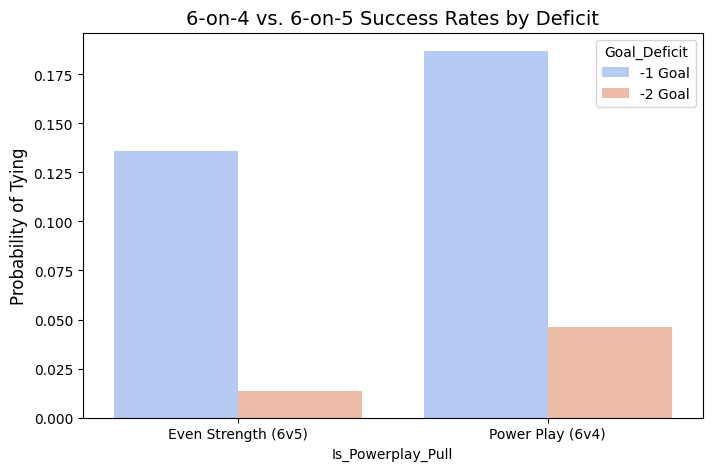
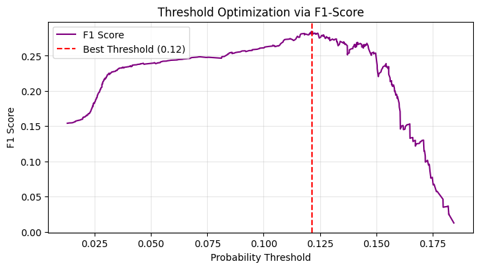
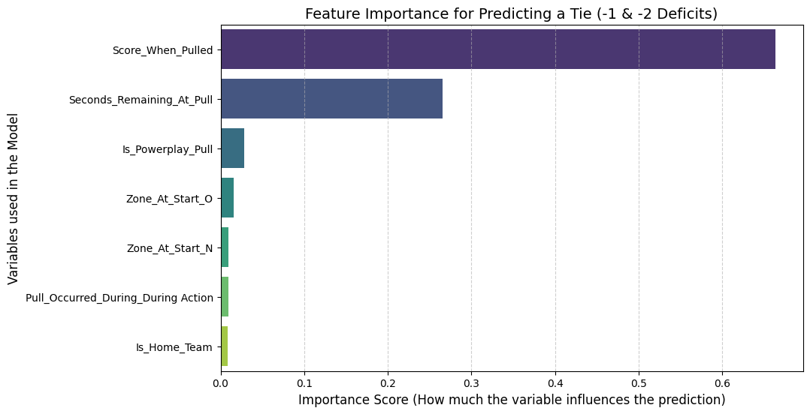
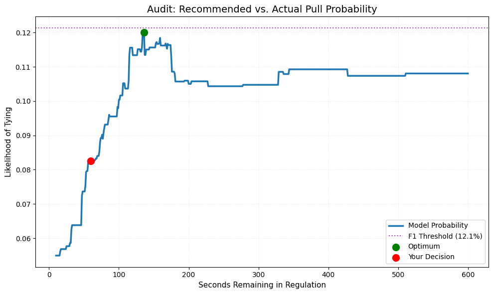
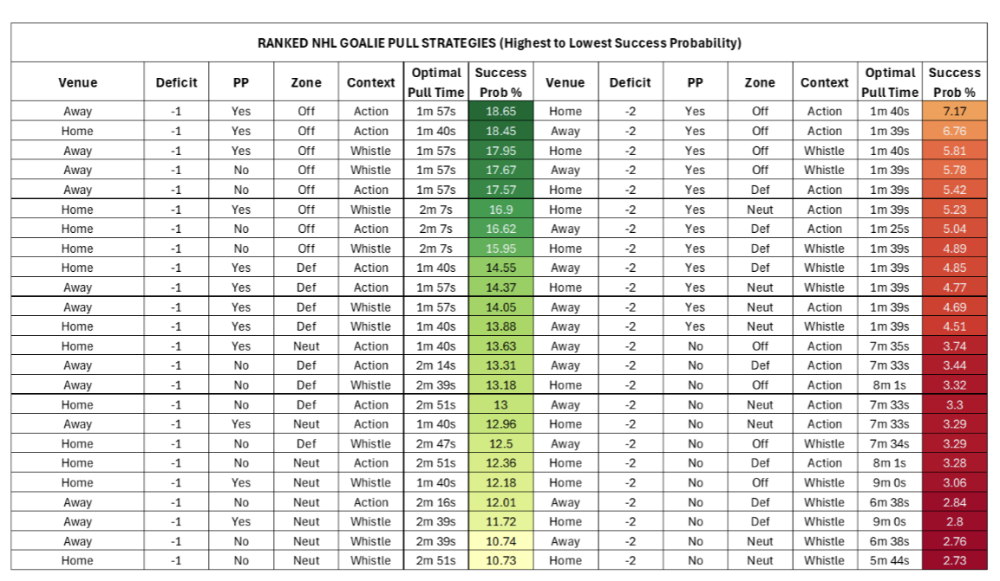

# NHL Goalie Pull Optimizer

Pulling the goalie is one of the most consequential decisions a coach makes in a close game. Pull too early and you give up an empty-net goal. Pull too late and you run out of time. This project uses 14 years of NHL play-by-play data to figure out when that decision actually works.

---

## What This Project Does

I built a machine learning model that predicts the likelihood of a trailing team tying the game after pulling their goalie in the 3rd period. The model is trained on every goalie pull from the 2010–2024 NHL regular seasons, with features capturing game context like time remaining, score deficit, zone, powerplay status, and whether the pull happened during live play or off a faceoff. (Data Retreived from Hockey-Statistics.com

Beyond the model itself, the project includes an interactive decision auditor where you can input a specific game scenario and see how a coach's actual pull timing compares to what the model recommends — including a full probability curve and a GO/HOLD recommendation.

---

## Project Structure

```
nhl-goalie-pull-optimizer/
├── data/
│   └── NHL_Goalie_Pull_Detailed_Analysis.csv
├── notebooks/
│   ├── Goalie_Pull_Data_Extraction.ipynb
│   └── Goalie_Pull_Analysis.ipynb
├── outputs/
│   ├── Goalie_Pull_Timing_History.png
│   ├── Tie_Success_Rate_Deficit.png
│   ├── Tie_Success_Rate_Faceoff.png
│   ├── Tie_Success_Rate_Powerplay.png
│   ├── Feature_Importance.png
│   ├── Model_Summary.png
│   ├── Example_Pull.png
│   └── Goalie_Pull_Strategies.png
├── .gitignore
├── requirements.txt
└── README.md
```

---

## Data

The raw play-by-play data covers NHL seasons from 2010 to 2024 and comes from [hockey-statistics.com](https://hockey-statistics.com/data/). The file is around 513MB so it is not included in this repository. To run the extraction notebook from scratch, download the file from that link, place it in the `data/` folder, and run the notebooks in order.

The cleaned output file (`NHL_Goalie_Pull_Detailed_Analysis.csv`) is already included, so you can jump straight to the analysis notebook without needing the raw data.

---

## Features

| Feature | Description |
|---|---|
| `Seconds_Remaining_At_Pull` | Time left on the clock when the goalie was pulled |
| `Score_When_Pulled` | Score deficit at time of pull (-1 or -2) |
| `Is_Home_Team` | Whether the pulling team was at home |
| `Is_Powerplay_Pull` | Whether the team had a power play advantage (6v4) |
| `Zone_At_Start` | Zone where play resumed after the pull |
| `Pull_Occurred_During` | Live action pull vs. pull before a faceoff |
| `Did_Successfully_Tie` | Target — did the team tie or go ahead? |

---

## Exploratory Data Analysis

**How pull timing has changed over 14 seasons**

Coaches have become meaningfully more aggressive over time, pulling earlier in both -1 and -2 deficit situations. The -2 deficit line shows the larger shift, with teams now pulling nearly a minute earlier on average compared to 2010.



**Tie success rate by timing window**

The 2–3 minute window has the highest success rate for -1 deficit situations, peaking around 23%. Pulling with less than 1 minute left drops success rates sharply — there simply isn't enough time to generate the necessary pressure.



**Does pulling during a faceoff vs. live play matter?**

Surprisingly, it makes almost no difference. Success rates for -1 deficit situations are nearly identical whether the goalie comes out before a faceoff or during live action. This suggests timing is a much bigger factor than the context of the pull.



**The power play advantage**

Having an extra attacker already on the ice (6-on-4 vs. 6-on-5) nearly doubles the probability of tying in a -1 deficit situation. For -2 deficits the effect is smaller but still meaningful — going from around 1.4% to 4.7%.



---

## Model

A Random Forest Classifier trained on an 80/20 split of regular season games. The decision threshold was optimized by maximizing F1-score across the precision-recall curve rather than using the default 0.5 cutoff, which better handles the class imbalance inherent in goalie pull outcomes. The optimal threshold landed at 0.12.



**Feature importance**

Score deficit and seconds remaining dominate the model's predictions by a wide margin. Powerplay status adds a meaningful secondary signal, while zone and pull context contribute very little. Home/away status is the least important variable.



---

## Decision Auditor

The analysis notebook includes a tool where you enter a game scenario and get back a full audit of the pull decision. Inputs are home/away, score deficit, powerplay status, starting zone, pull context, and the time in seconds remaining when the goalie was pulled. The output shows the model's optimal pull time, the probability at your chosen time, the probability lost by not pulling at the optimal moment, and a GO/HOLD call based on the F1 threshold.

The example below shows a scenario where the coach pulled with 60 seconds remaining. The model identifies ~130 seconds as the optimal window, with a peak probability around 12%. The coach's actual pull came in below the F1 threshold, resulting in a HOLD recommendation.



---

## Goalie Pull Cheat Sheet

The notebook generates a ranked table of every possible scenario combination — home/away, deficit, powerplay, zone, and context — sorted by predicted success probability. The top strategies across all scenarios involve -1 deficit situations with a power play advantage and an offensive zone start, peaking at roughly 18–19% success probability.



---

## How to Run

Install dependencies:
```bash
pip install -r requirements.txt
```

Then open and run the notebooks in order. Start with `Goalie_Pull_Data_Extraction.ipynb` if you have the raw CSV, or go straight to `Goalie_Pull_Analysis.ipynb` using the pre-processed data file already in `data/`.

---

## Requirements

```
pandas
numpy
scikit-learn
matplotlib
seaborn
```

---

## Author

Nick Knowles — connect with me on [LinkedIn]((https://www.linkedin.com/in/nicholas-knowles))
